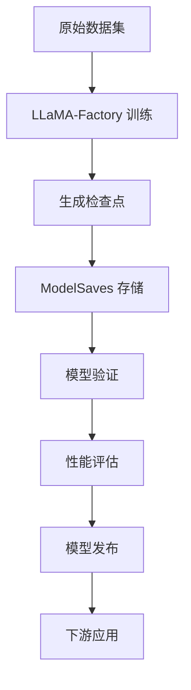

# ModelSaves 项目架构与功能说明

## 项目概述

ModelSaves 是一个专门用于存储和管理基于 LLaMA-Factory 框架进行微调训练的模型检查点和相关资源的仓库。本项目隶属于 Inteli_buli_project，旨在为大语言模型的微调工作提供版本化的模型存储解决方案。

## 项目架构

### 1. 整体架构设计

```
modelsaves/
├── README.md                    # 项目说明文档
├── 项目架构与功能说明.md         # 本文档
├── models/                      # 模型存储目录（规划中）
│   ├── checkpoints/            # 训练检查点
│   ├── final_models/           # 最终训练模型
│   └── adapters/               # LoRA/QLoRA 适配器
├── configs/                     # 配置文件目录（规划中）
│   ├── training_configs/       # 训练配置
│   └── model_configs/          # 模型配置
├── scripts/                     # 工具脚本（规划中）
│   ├── upload_model.py         # 模型上传脚本
│   ├── download_model.py       # 模型下载脚本
│   └── verify_model.py         # 模型验证脚本
└── docs/                       # 文档目录（规划中）
    ├── training_logs/          # 训练日志
    └── model_performance/      # 模型性能报告
```

### 2. 技术栈

- **框架**: LLaMA-Factory
- **模型类型**: LLaMA 系列大语言模型
- **微调技术**: 
  - LoRA (Low-Rank Adaptation)
  - QLoRA (Quantized LoRA)
  - 全参数微调
- **版本控制**: Git + Git LFS (用于大文件)
- **存储格式**: 
  - PyTorch (.pt, .pth)
  - Transformers (.bin, .safetensors)
  - ONNX (.onnx)

## 功能模块

### 1. 核心功能

#### 1.1 模型存储管理
- **检查点存储**: 存储训练过程中的模型检查点
- **版本控制**: 对模型文件进行版本化管理
- **元数据记录**: 记录模型训练参数、性能指标等元信息

#### 1.2 模型组织分类
- **按任务分类**: 根据不同的下游任务组织模型
- **按版本分类**: 维护模型的历史版本
- **按性能分类**: 根据模型性能指标进行分类

#### 1.3 模型验证与测试
- **完整性检查**: 验证模型文件的完整性
- **兼容性测试**: 确保模型与 LLaMA-Factory 框架兼容
- **性能基准**: 提供模型性能基准测试

### 2. 辅助功能

#### 2.1 配置管理
- **训练配置**: 存储和管理训练时使用的配置文件
- **推理配置**: 管理模型推理时的配置参数
- **环境配置**: 记录训练环境和依赖信息

#### 2.2 文档与日志
- **训练日志**: 保存详细的训练过程日志
- **性能报告**: 生成模型性能评估报告
- **使用说明**: 提供模型使用和部署指南

#### 2.3 工具脚本
- **自动化脚本**: 提供模型上传、下载、验证等自动化工具
- **转换工具**: 支持不同格式间的模型转换
- **部署工具**: 简化模型部署流程

## 与 LLaMA-Factory 生态系统的集成

### 1. 工作流集成



### 2. 配置兼容性
- 完全兼容 LLaMA-Factory 的配置格式
- 支持 LLaMA-Factory 的所有训练模式
- 维护与上游框架的同步更新

### 3. 模型格式支持
- 支持 LLaMA-Factory 输出的所有模型格式
- 兼容 Hugging Face Transformers 格式
- 支持量化模型存储

## 使用场景

### 1. 研究开发
- **实验管理**: 管理多个实验的模型检查点
- **对比分析**: 比较不同训练策略的效果
- **版本回退**: 支持回退到历史版本进行分析

### 2. 生产部署
- **模型分发**: 向生产环境分发经过验证的模型
- **版本管理**: 管理生产环境中的模型版本
- **回滚支持**: 支持快速回滚到稳定版本

### 3. 团队协作
- **共享资源**: 团队成员间共享训练好的模型
- **知识传承**: 保存项目的模型训练历史
- **标准化**: 建立团队的模型管理标准

## 项目状态

### 当前状态
- ✅ 项目初始化完成
- ✅ 基础文档结构建立
- ⏳ 目录结构规划中
- ⏳ 工具脚本开发中

### 近期规划
1. **建立目录结构**: 创建标准的项目目录结构
2. **开发工具脚本**: 实现基础的模型管理工具
3. **集成 Git LFS**: 配置大文件存储支持
4. **文档完善**: 补充详细的使用文档和示例

### 长期目标
1. **自动化流水线**: 建立完整的 CI/CD 流水线
2. **Web 界面**: 开发模型管理的 Web 界面
3. **API 服务**: 提供模型管理的 RESTful API
4. **监控告警**: 实现模型性能监控和告警机制

## 贡献指南

### 1. 代码贡献
- 遵循项目的编码规范
- 提交前运行完整的测试套件
- 确保文档与代码同步更新

### 2. 模型贡献
- 提供完整的训练配置和日志
- 包含详细的模型性能评估
- 遵循统一的命名和组织规范

### 3. 文档贡献
- 保持文档的准确性和时效性
- 提供清晰的使用示例
- 支持多语言文档（中英文）

## 技术支持

- **项目维护者**: MegaArn1
- **相关项目**: Inteli_buli_project
- **技术栈**: LLaMA-Factory + PyTorch + Transformers
- **社区支持**: 通过 Issues 和 Discussions 获取支持

---

*本文档将随着项目发展持续更新，请关注最新版本。*